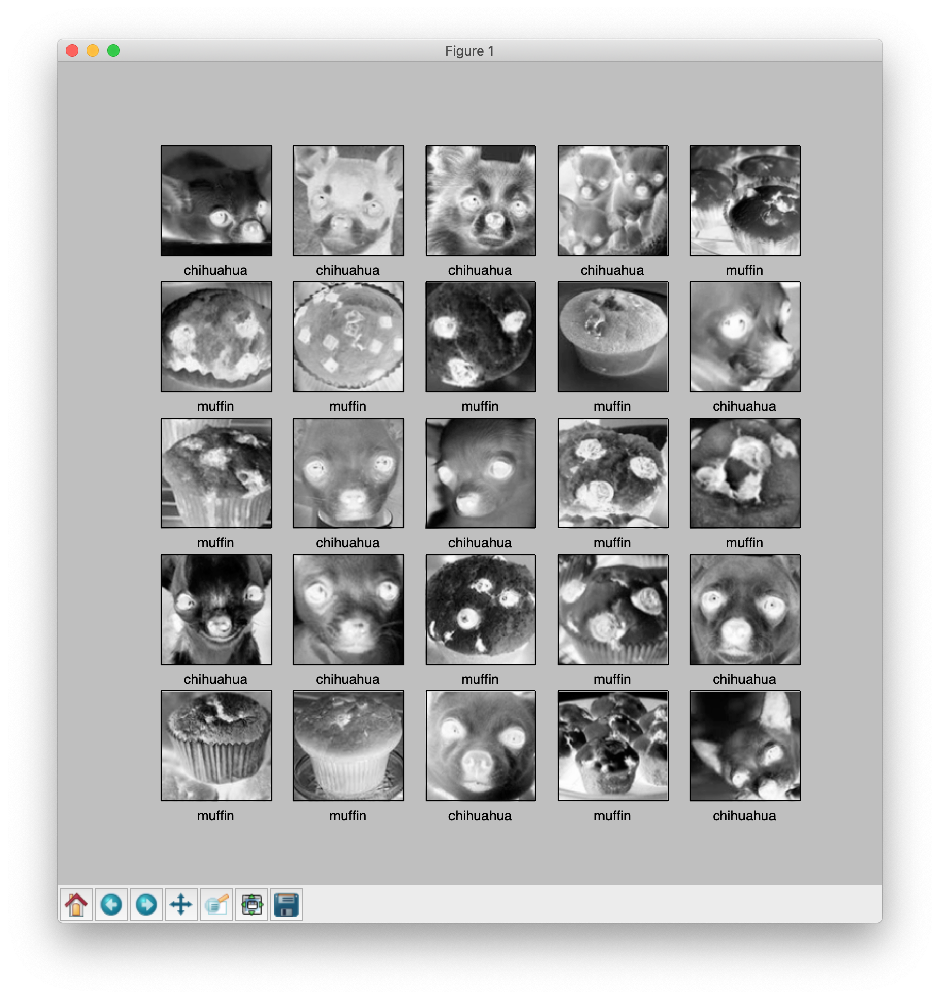
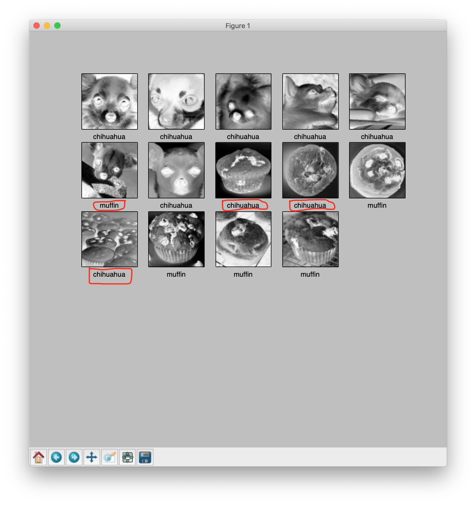

# Solving a muffin or a Chihuahua, image recognition challenge with tensorflow and keras.

Deep neural network or Deep learning has become very popular in last few years, thanks to all the breakthroughs in research. I wanted to use deep neural network for solving something other than hello world of image recognition i.e. MNIST handwritten letters recognition. After going through the first tutorial on tensorflow and keras library, this became the first image recognition challenge to solve. Since both are very similar looking objects, it appeared to be an interesting challenge.

This solution applies the same techniques as given in, 

[https://www.tensorflow.org/tutorials/keras/basic_classification](https://www.tensorflow.org/tutorials/keras/basic_classification).


## Import the data.

### Git clone this repository.
```
$ git clone https://github.com/ScrapCodes/deep-learning-datasets.git
$ cd deep-learning-datasets
$ python 
>>>
```

### Import tensorflow, keras and other helper libraries. 

In this blog, we have used `tensorflow` and `keras` for running machine learning and `Pillow` python library for image processing.

Using pip these can be installed on Macos X as follows,

```
$ sudo pip install tensorflow matplotlib pillow
```

Importing the python libraries. 

```python
# TensorFlow and tf.keras
import tensorflow as tf
from tensorflow import keras

# Helper libraries
import numpy as np
import matplotlib.pyplot as plt
import glob, os
import re

# Pillow
import PIL
from PIL import Image

```

### Load the data

A python function to preprocess input images. For images to be converted into numpy arrays, they must have same dimensions.

```python
# Use Pillow library to convert an input jpeg to a 8 bit grey scale image array for processing.
def jpeg_to_8_bit_greyscale(path, maxsize):
	img = Image.open(path).convert('L')   # convert image to 8-bit grayscale
	# Make aspect ratio as 1:1, by applying image crop.
    # Please note, croping works for this dataset, but in general one 
    # needs to locate the subject and then crop or scale accordingly.
	WIDTH, HEIGHT = img.size
	if WIDTH != HEIGHT:
		m_min_d = min(WIDTH, HEIGHT)
		img = img.crop((0, 0, m_min_d, m_min_d))
	# Scale the image to the requested maxsize by Anti-alias sampling.
	img.thumbnail(maxsize, PIL.Image.ANTIALIAS)
	return np.asarray(img)
```

A python funciton to load the dataset from images, into numpy arrays.

```python
def load_image_dataset(path_dir, maxsize):
	images = []
	labels = []
	os.chdir(path_dir)
	for file in glob.glob("*.jpg"):
		img = jpeg_to_8_bit_greyscale(file, maxsize)
		if re.match('chihuahua.*', file):
			images.append(img)
			labels.append(0)
		elif re.match('muffin.*', file):
			images.append(img)
			labels.append(1)
	return (np.asarray(images), np.asarray(labels))
```

We should scale the images to some standard size smaller than actual image resolution. These images are more than 170x170 in size, so we scale them all to 100x100 for furthur processing.

```python
maxsize = 100, 100
```

To load the data, let's execute these functions and load training and test data sets as follows.

```python
(train_images, train_labels) = load_image_dataset('/Users/prashant/deep-learning-datasets/chihuahua-muffin', maxsize)

(test_images, test_labels) = load_image_dataset('/Users/prashant/deep-learning-datasets/chihuahua-muffin/test_set', maxsize)

```

* train_images and train lables is Training dataset
* test_images and test_labels is testing dataset for validating our model's performance against unseen data.


Last we define the class names for our dataset. Since this data has only two classes i.e. an image can either be a Chihuahua or a Muffin, we have `class_names` as follows.

```python
class_names = ['chihuahua', 'muffin']
```

## Explore the data

In this dataset we have total 26 training examples, of both Chihuahua and Muffin images.

```python
train_images.shape
(26, 100, 100)
```

Each image has it's respective label - either a `0` or `1`. A `0`indicates a `class_names[0]` i.e. a `chihuahua` and `1` indicates `class_names[1]` i.e. a `muffin`.

```python
print(train_labels)
[0 0 0 0 1 1 1 1 1 0 1 0 0 1 1 0 0 1 1 0 1 1 0 1 0 0]
```

For test set, we have got 14 examples, 7 for each class.

```python
test_images.shape
(14, 100, 100)
print(test_labels)
[0 0 0 0 0 0 0 1 1 1 1 1 1 1]
```
### Visualize the dataset.

Using `matplotlib.pyplot` python library, we can visualize our data. Make sure you have matplotlib library installed.

Following python helper function helps us draw these images on our screen.

```python
def display_images(images, labels):
	plt.figure(figsize=(10,10))
	grid_size = min(25, len(images))
	for i in range(grid_size):
		plt.subplot(5, 5, i+1)
		plt.xticks([])
		plt.yticks([])
		plt.grid(False)
		plt.imshow(images[i], cmap=plt.cm.binary)
		plt.xlabel(class_names[labels[i]])
```

Let's visualize the training dataset, as follows :

```python
display_images(train_images, train_labels)
plt.show()
```


Note: the images are greyscaled and cropped, in the pre-processing step of our images at the time of loading.

Similarly we can visualize our test data set. Both training and test set are fairly limited, feel free to use google search and add more examples and see how things improve or perform.

## Preprocess the data

### Scaling the images to values between 0 and 1.

```python
train_images = train_images / 255.0
test_images = test_images / 255.0
```

## Build the model

### Setup the layers

We have used four layers in total, the first layer is to simply flatten the dataset into a single array and does not get training. Rest three layers are dense and use sigmoid as activation function. 

```python
# Setting up the layers.

model = keras.Sequential([
    keras.layers.Flatten(input_shape=(100, 100)),
  	keras.layers.Dense(128, activation=tf.nn.sigmoid),
  	keras.layers.Dense(16, activation=tf.nn.sigmoid),
    keras.layers.Dense(2, activation=tf.nn.softmax)
])

```
### Compile the model
Optimizer is SGD, i.e. stochastic gradient descent. 

```python
sgd = keras.optimizers.SGD(lr=0.01, decay=1e-5, momentum=0.7, nesterov=True)

model.compile(optimizer=sgd, 
              loss='sparse_categorical_crossentropy',
              metrics=['accuracy'])

```

## Train the model


```python
model.fit(train_images, train_labels, epochs=100)
```

Last three training iterations appear as follows:

```
....
Epoch 98/100
26/26 [==============================] - 0s 555us/step - loss: 0.3859 - acc: 0.9231
Epoch 99/100
26/26 [==============================] - 0s 646us/step - loss: 0.3834 - acc: 0.9231
Epoch 100/100
26/26 [==============================] - 0s 562us/step - loss: 0.3809 - acc: 0.9231
<tensorflow.python.keras.callbacks.History object at 0x11e6c9590>
```

## Evaluate accuracy
```python
test_loss, test_acc = model.evaluate(test_images, test_labels)
print('Test accuracy:', test_acc)
```

```
14/14 [==============================] - 0s 8ms/step
('Test accuracy:', 0.7142857313156128)
```

Test accuracy is less than training accuracy. This indicates model has overfit the data. There are techniques to overcome this problem, we will discuss those later. This model is a good example of the use of API, but very far from perfect.

With recent advances in image recognition and using more training data, we can perform much better on this dataset challenge.

## Make predictions

To make predictions we can simply call predict on the generated model.

```python
predictions = model.predict(test_images)
```

```
print(predictions)

[[0.6080283  0.3919717 ]
 [0.5492342  0.4507658 ]
 [0.54102856 0.45897144]
 [0.6743213  0.3256787 ]
 [0.6058993  0.39410067]
 [0.472356   0.5276439 ]
 [0.7122982  0.28770176]
 [0.5260602  0.4739398 ]
 [0.6514299  0.3485701 ]
 [0.47610506 0.5238949 ]
 [0.5501717  0.4498284 ]
 [0.41266635 0.5873336 ]
 [0.18961382 0.8103862 ]
 [0.35493374 0.64506626]]
```

Finally, lets display images and see how our model performed on test set.

```python
display_images(test_images, np.argmax(predictions, axis = 1))
plt.show()
```



We see a few wrong classifications in our result, as highlighted in the above image. So this stuff is far from perfect. In next article, we will see how we can improve things.
 
Thanks, alot for going through. Please open issues for suggestions or feedback.

## License:

```python
#@title MIT License
#
# Copyright (c) 2018 IBM
#
# Permission is hereby granted, free of charge, to any person obtaining a
# copy of this software and associated documentation files (the "Software"),
# to deal in the Software without restriction, including without limitation
# the rights to use, copy, modify, merge, publish, distribute, sublicense,
# and/or sell copies of the Software, and to permit persons to whom the
# Software is furnished to do so, subject to the following conditions:
#
# The above copyright notice and this permission notice shall be included in
# all copies or substantial portions of the Software.
#
# THE SOFTWARE IS PROVIDED "AS IS", WITHOUT WARRANTY OF ANY KIND, EXPRESS OR
# IMPLIED, INCLUDING BUT NOT LIMITED TO THE WARRANTIES OF MERCHANTABILITY,
# FITNESS FOR A PARTICULAR PURPOSE AND NONINFRINGEMENT. IN NO EVENT SHALL
# THE AUTHORS OR COPYRIGHT HOLDERS BE LIABLE FOR ANY CLAIM, DAMAGES OR OTHER
# LIABILITY, WHETHER IN AN ACTION OF CONTRACT, TORT OR OTHERWISE, ARISING
# FROM, OUT OF OR IN CONNECTION WITH THE SOFTWARE OR THE USE OR OTHER
# DEALINGS IN THE SOFTWARE.
```